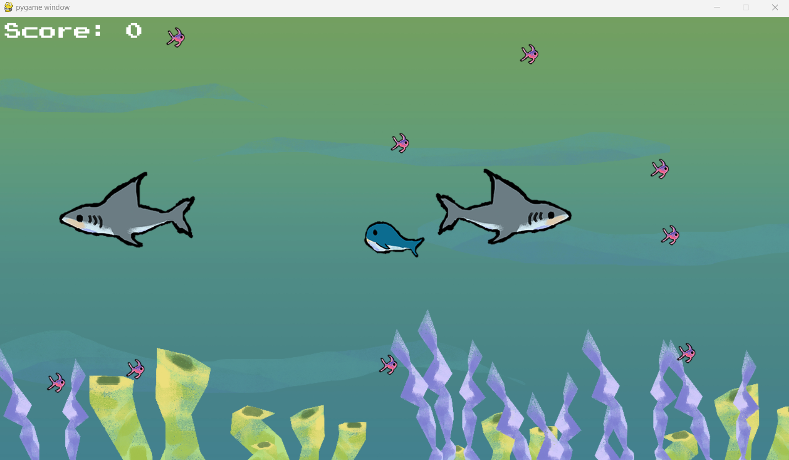
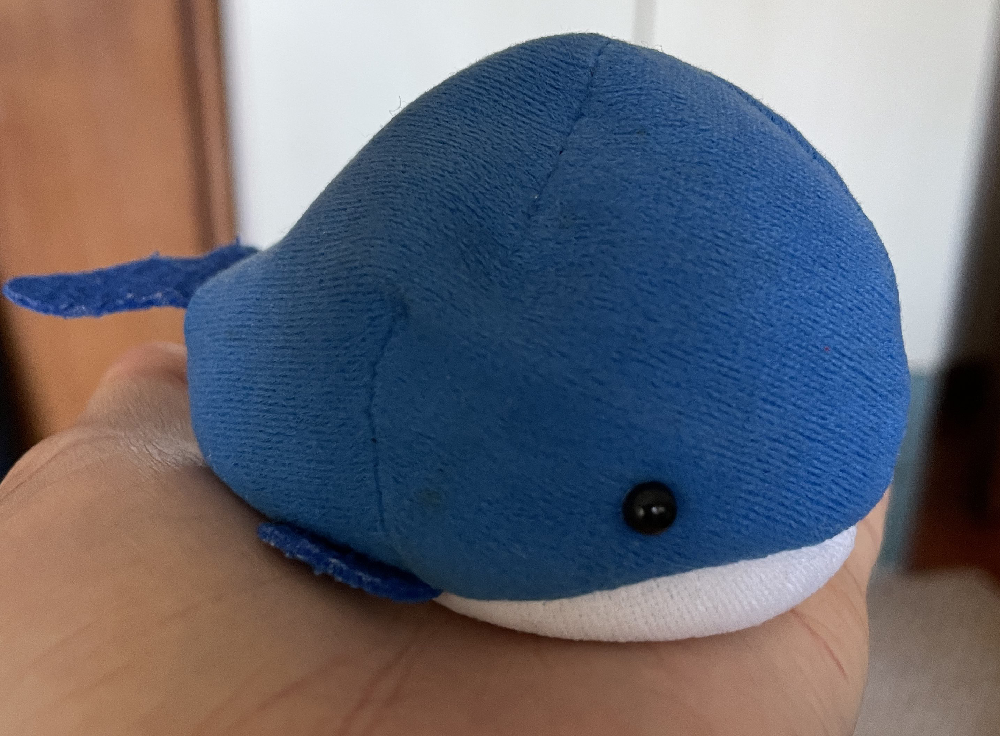

# Feed Mushy the Whale Game



A simple python game made using pygame!

Created while attending MLH Global Hack Week Games

* Art by Jocelyn Tang
* Royalty Free Sound Effects: Mixkit

### Play on Windows
...

### Play on the Web
...

## Getting Started:
Install requirements.txt to install correct python version and pygame (I used Python 3.11.8)
	```
	pip install -r requirements.txt
	```

Create Python Virtual Environment:
Windows Powershell Terminal:
```
python -m venv env
```

Initialize Python Virtual Environment:
Windows Powershell Terminal:
```
./env/Scripts/activate
```

Update requirements.txt:
```
pip freeze > requirements.txt
```

Start the program!
```
python main.py
```

## Inspiration!
